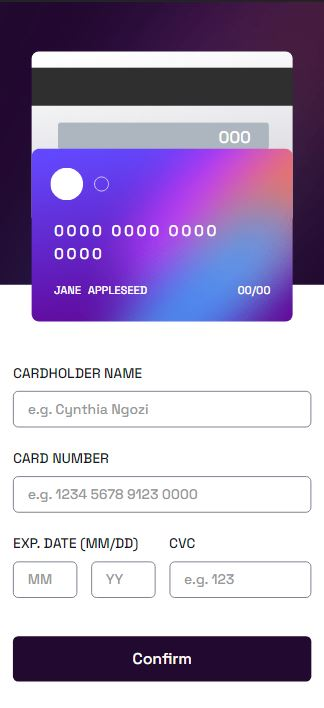
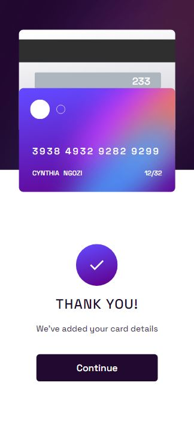

# Frontend Mentor - Interactive card details form solution

This is a solution to the [Interactive card details form challenge on Frontend Mentor](https://www.frontendmentor.io/challenges/interactive-card-details-form-XpS8cKZDWw). Frontend Mentor challenges help you improve your coding skills by building realistic projects. 

## Table of contents

- [Overview](#overview)
  - [The challenge](#the-challenge)
  - [Screenshot](#screenshot)
  - [Links](#links)
- [My process](#my-process)
  - [Built with](#built-with)
  - [What I learned](#what-i-learned)
  - [Continued development](#continued-development)
  - [Useful resources](#useful-resources)
- [Author](#author)
- [Acknowledgments](#acknowledgments)

## Overview

### The challenge

Users should be able to:

- Fill in the form and see the card details update in real-time
- Receive error messages when the form is submitted if:
  - Any input field is empty
  - The card number, expiry date, or CVC fields are in the wrong format
- View the optimal layout depending on their device's screen size
- See hover, active, and focus states for interactive elements on the page

### Screenshot





### Links

- Solution URL: [Github solution URL here](https://github.com/cindyeme/interactive-card-details-form)
- Live Site URL: [Add live site URL here](https://your-live-site-url.com)

## My process

### Built with

- JSX
- CSS custom properties
- Flexbox
- Mobile-first workflow
- [TailwindCSS](https://tailwindcss.com/) - CSS framework
- [Next.js](https://nextjs.org/) - React framework
- [Yup](https://github.com/jquense/yup) - For validations

### What I learned

While working on this, I learned how to write logic for form validation, handle the form input changes when it got to splitting the card numbers into four separate digits, and how to find solutions and fix bugs as I encounter them.


See some code snippet below below:

```js
 const handleInputChange = (e) => {
    if (e.target.name === "number" && e.target.value) {
      e.target.value = e.target.value
        .replace(/\s/g, "")
        .replace(/(.{4})/g, "$1 ")
        .trim()
        .slice(0, 19);
    }

    if (e.target.name === "expiryMonth" || e.target.name === "expiryYear") {
      e.target.value = e.target.value
        .toString()
        .replace(/[^0-9]/g, "")
        .substring(0, 2);
      if (e.target.name === "expiryMonth" && e.target.value > 12)
        e.target.value = "12";
    }

    if (e.target.name === "cvc") {
      e.target.value = e.target.value.substring(0, 3);
    }
    setFormData({ ...formData, [e.target.name]: e.target.value });
  };
```

```js
const handleSubmit = async (e) => {
  e.preventDefault();
  const isFormValid = await validationSchema.isValid(formData, {
    abortEarly: false,
  });

  if (isFormValid) {
    setValidate(true);
    setErrors({
      name: "",
      number: "",
      expiryMonth: "",
      expiryYear: "",
      cvc: "",
    });
  } else {
    validationSchema
      .validate(formData, { abortEarly: false })
      .catch((error) => {
        const errors = error.inner.reduce((acc, error) => {
          return {
            ...acc,
            [error.path]: error.message,
          };
        }, {});
        setErrors({
          name: errors.name,
          number: errors.number,
          expiryMonth: errors.expiryMonth,
          expiryYear: errors.expiryYear,
          cvc: errors.cvc,
        });
      });
    }
  };
```

### Continued development

I would be using more of React.js and Next.js frameworks in the coming challenges and would enjoy implementing logics.

## Author

- Website - [Emerenini Cynthia Ngozi](emereninicynthiangozi.herokuapp.com)
- Frontend Mentor - [@cindyeme](https://www.frontendmentor.io/profile/cindyeme)
- Twitter - [@CynthiaENgozi1](https://www.twitter.com/cynthiaengozi1)
